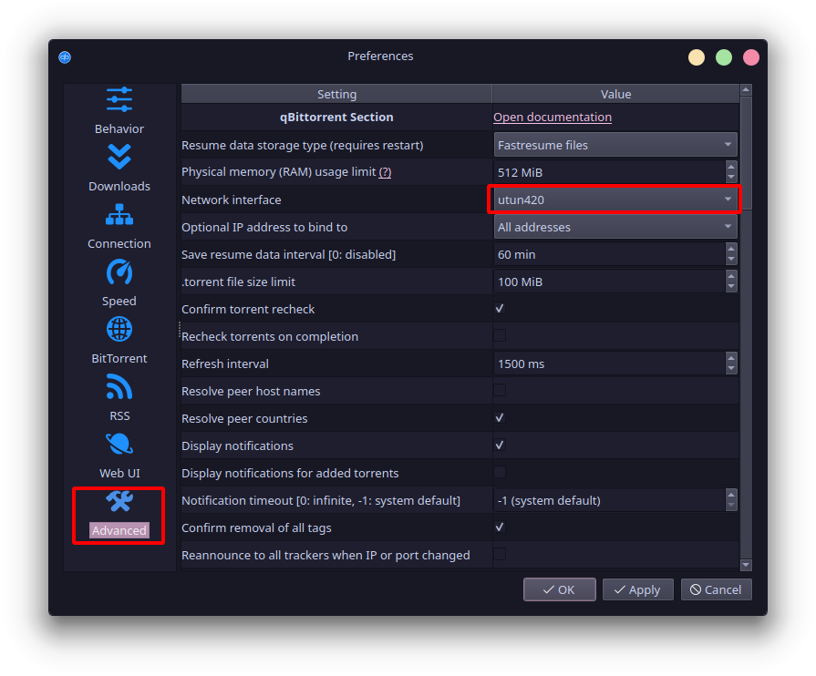

# Port Forwarding with Windscribe for qBitTorrent - A Guide

### Requirements

* [Windscribe Pro](https://windscribe.com/upgrade)
     * If you'd like permanent port forwarding, you must also purchase a [static IP.](https://windscribe.com/staticips) 
* qBitTorrent
* WireGuard, IKEv2 (best), or UDP (alright), or TCP, Stealth, and WStunnel (not recommended unless you cannot use the others). Port isn't very important. 443 is best. \

### Activate Ephemeral Port Forwarding

1. [Log in to Windscribe.](https://windscribe.com/login)
2. Go to the [ephemeral port forwarding page.](https://windscribe.com/myaccount#porteph)
3. Request **matching** or **specific** port. **Note down the port.**
     * If you selected specific, note down the port that **you typed in**, NOT the external port it assigns to you.
4. Disconnect (if currently connected) and reconnect. 
     * For WireGuard users, you may have to switch servers or disconnect for a brief period of time.

##### Keep in Mind

* You must renew the port every 7 days. Matching ports will require that you change the port number in qBitTorrent every time you renew. Specific port will allow you to keep that setting the same, though you'll have to reconnect qBitTorrent when you renew the port in either case.

### Activate Permanent Port Forwarding ([Static IPs Only](https://windscribe.com/staticips))

1. [Log in to Windscribe.](https://windscribe.com/login)
2. Go to the [static IP port forwarding page.](https://windscribe.com/myaccount#portforwards)
3. Select the location you've purchased, and configure your options. 
     1. Name the service. Choose whatever you want, since it doesn't affect anything.
     2. Select **TCP.**
     3. Select the device you want to port forward with. 
          * You must **connect at least once** for a device to appear.
     4. Choose a port number.
          * You can use a port number of your choosing for both internal and external, though it's [recommended you keep them the same](#matching-vs-specific-ports). **Note down the internal port.**
          * It's also a better idea to choose a higher port number (greater than 10000). 
4. Disconnect (if currently connected) and reconnect. 
     * For WireGuard users, you may have to switch servers or disconnect for a brief period of time.

### Configure Windscribe & qBitTorrent

1. Open Windscribe, and connect.
2. Turn on the **always on firewall**. This prevents your internet traffic from leaking in the event Windscribe disconnects. Leave this setting on for the remainder of your torrenting session. \

3. Open qBitTorrent.
4. Press Alt + O. This should open the Preferences menu for qBitTorrent. You can also select Tools > Preferences on the top.
5. Select *Connection* on the left.
6. Select **TCP** as your peer connection method, and type in the port you noted down. **Disable UPnP** as well. \

7. Select *Advanced* on the left.
8. **Bind** qBitTorrent to your **VPN network interface**. 
    * Windows:
         * On WireGuard, it should be titled **Windscribe WireGuard**.
         * On IKEv2, it should be titled **Windscribe IKEv2**.
         * On OpenVPN (UDP/TCP/Stealth/WStunnel) it should be titled **Local Area Connection** (potentially with a number). You will have to check this in your Windows adapter settings. 
    * Linux, MacOS:
         * The network interface may show up as **utun420** or **tun0**.

9. Check if your port is forwarding. You can do this at [YouGetSignal](https://www.yougetsignal.com/tools/open-ports/) or [Can You See Me.](https://canyouseeme.org/) Make sure you type in the correct port. If it says it is open, then you are good to go.

Make sure you **do not turn off Windscribe's Always On firewall before you close your torrenting client.** Make sure to **close your torrenting client from the tray** before you shut down the VPN and its firewall. **You will need to turn off the Always-On firewall if you want to use the internet without a VPN after you are done.** You can set it to automatic or manual in order to disable the always on firewall.

Do not open your torrenting client without the VPN connected and with the Always On firewall active. This is a risk and **may leak your true IP.**

### Troubleshooting

#### Matching vs. Specific Ports
- I have observed that in certain cases, some people may have issues succeeding with port forwarding if they use specific port (as in, select their own port instead of using the matching option). If port forwarding does not work, try using matching port instead.
     - Matching port requires that you change the port in the qBitTorrent every week. Specific port (since the internal port is always the same) negates this, and if that functions properly for you, you're more than welcome to use it!